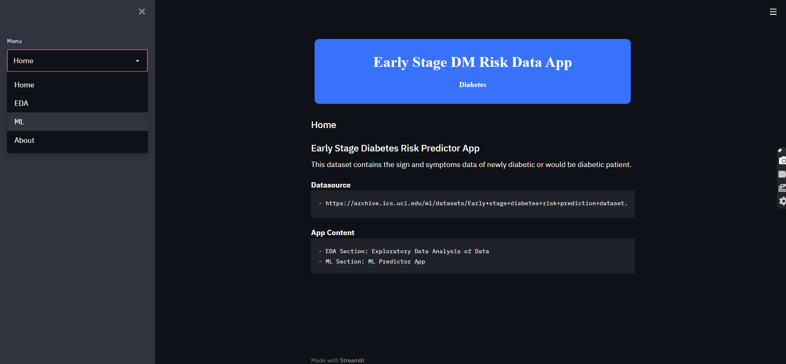
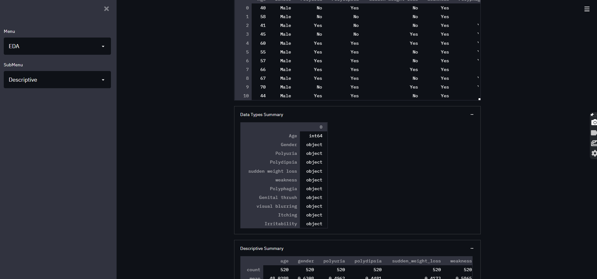
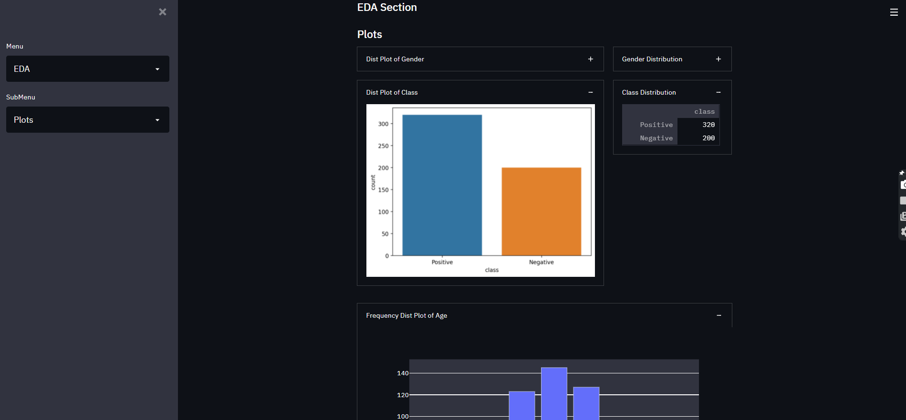
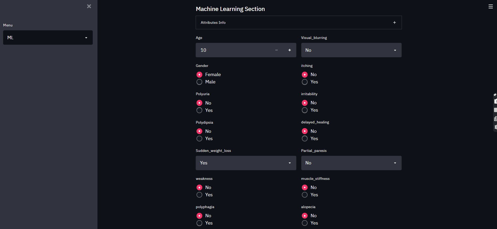
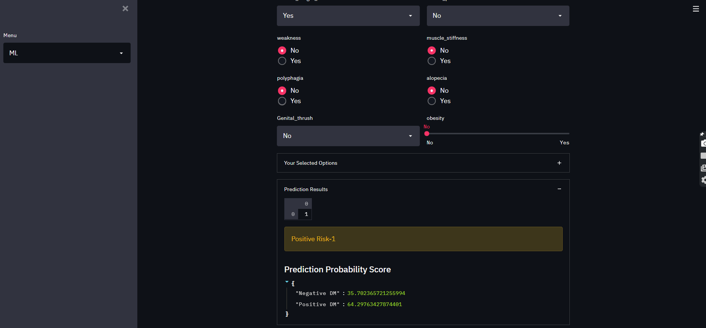

Early stage diabetes prediction app was made using streamlit. 

Streamlit is an open-source app framework for Machine Learning and Data Science teams. It helps to showcase graph, results in a beautiful manner .

Diabetes prediction app tries to predict the outcome whether the person is at stage of diabetes danger or not. The user has to answer some question like:-
-> Physical stiffness - YES / NO
-> Obesity - YES / NO
-> Gential thrust- YES / NO
-> Itching - YES / NO
-> Polyuria - YES / NO
-> Gender - Male / Female

The first image is the home page. It consist of one sidebar Menu which includes 
->HOME
->EDA
->Machine learning
->About

and the general description with the data setlink.

The second image consist of EDA — Exploratory Data Analysis .
To get the broader look of the dataset by visualizing, summarizing and interpreting the information that is hidden in rows and column format.
This the descriptive column

This is the plot(graphs) columns.

Now comes the ML part, where some question was asked from the dataset columns and the user have to answer to get the prediction result.

